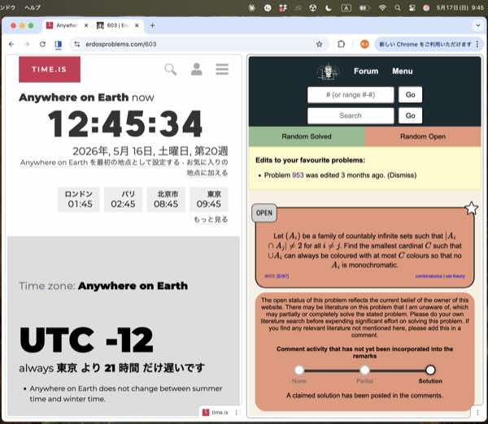

# Lean Formalizations of Erdős Problem 603

This repository contains Lean formalization work for Erdős Problem 603.

The work is based on Przemek Chojecki's PDF solution/discussion of Erdős
Problem 603 and on the discussion in the Erdős Problems forum thread for
Problem 603.  Throughout this README, "the PDF" refers to Chojecki's PDF:
<https://www.ulam.ai/research/erdos603.pdf>.

**Lean4Web Demo, Interpretation 1:** [Open in Lean 4](https://live.lean-lang.org/#project=mathlib-v4.29.1&url=https%3A%2F%2Fraw.githubusercontent.com%2FKitaKen1%2Ferdos603-lean%2Frefs%2Fheads%2Fmain%2FErdos603CountableSequenceLean4Web.lean)

**Lean4Web Demo, Interpretation 2 conditional:** [Open in Lean 4](https://live.lean-lang.org/#project=mathlib-v4.29.1&url=https%3A%2F%2Fraw.githubusercontent.com%2FKitaKen1%2Ferdos603-lean%2Frefs%2Fheads%2Fmain%2FErdos603ArbitrarySizeConditionalLean4Web.lean)

## Overview

Erdős Problem 603 admits at least two natural readings.

- Interpretation 1: the countable-sequence reading.
- Interpretation 2: the arbitrary-size-family reading.

This repository currently contains:

- a complete Lean formalization of Interpretation 1; and
- a conditional Lean formalization of the PDF construction for Interpretation 2,
  assuming the relevant Erdős--Rado/partition-relation input.

For Interpretation 1, the repository includes both a standard Lean/Lake version
and a standalone Lean4Web version.

The Lean4Web version is intended for copy-paste checking in Lean4Web with
Mathlib enabled.

For Interpretation 2, the repository proves the arbitrary-size-family
counterexample from the hypothesis `ArrowOmegaTwo κ μ`, which represents the
partition relation `κ → (ω)^2_μ`: every `μ`-coloring of unordered pairs from
`κ` has a countably infinite monochromatic complete subgraph.

The Interpretation 2 file does not formalize Erdős--Rado itself.  It formalizes
the PDF construction conditional on that input, and then derives the conditional
negative conclusion that no universal color cardinal exists if this input is
available for every color type.

Important Lean-checking note: `#print axioms` reports undeclared axiom
dependencies, but it does not report ordinary theorem hypotheses.  Therefore,
even if
`#print axioms Erdos603.ArbitrarySizeConditional.arbitrary_size_counterexample_from_erdos_rado`
shows only Lean/Mathlib foundations, the theorem is still conditional because
its statement has the explicit hypothesis `hER : ArrowOmegaTwo κ μ`.
To check whether a theorem is unconditional, inspect its statement with
`#check` as well as its axiom list.

## Project Status

As of May 17, 2026, the Erdős Problems page for Problem 603 shows that an
answer has been submitted, but the answer is not yet confirmed.  This
repository is a Lean formalization project intended to check and clarify the
submitted argument and the possible readings of the problem.



## Sources

This formalization is based on:

- Przemek Chojecki's PDF solution/discussion of Erdős Problem 603:
  <https://www.ulam.ai/research/erdos603.pdf>
- the discussion of Problem 603 on the Erdős Problems forum:
  <https://www.erdosproblems.com/forum/thread/603>.

## Mathematical Content

### Interpretation 1

If `A : ℕ → Set α` is a countable sequence of infinite sets, then there exists
a two-coloring `c : α → Bool` such that every `A n` contains points of both
colors.

In Lean, the main theorem is:

```lean
theorem Erdos603.CountableSequence.countable_family_two_colorable
    (A : ℕ → Set α) (hA : ∀ n, (A n).Infinite) :
    ∃ c : α → Bool, ∀ n, ContainsBothColors c (A n)
```

### Interpretation 2, Conditional on Erdős--Rado Input

The arbitrary-size-family reading asks for a family `𝒜` of countably infinite
sets such that pairwise intersections never have size `2`, while every
`μ`-coloring of the union makes some member of `𝒜` monochromatic.

The formalized conditional construction is:

```lean
theorem Erdos603.ArbitrarySizeConditional.arbitrary_size_counterexample_from_erdos_rado
    (hER : ArrowOmegaTwo κ μ) :
    Erdos603Counterexample κ μ
```

Here `ArrowOmegaTwo κ μ` is the partition-relation input corresponding to
`κ → (ω)^2_μ`.

The construction is the one from the PDF:

- the ground set is `Sym2 κ`, unordered pairs of vertices;
- for each countably infinite `X ⊆ κ`, the family contains `[X]^2`; and
- intersections are `[X ∩ Y]^2`, so their finite sizes are binomial numbers,
  never `2`.

The final conditional theorem is:

```lean
theorem Erdos603.ArbitrarySizeConditional.no_universal_color_cardinal_of_erdos_rado
    (hER_all : ∀ χ : Type u, ∃ κ : Type u, ArrowOmegaTwo κ χ) :
    ¬ ∃ χ : Type u, UniversalColorCardinal χ
```

This says that, assuming the relevant Erdős--Rado/partition input for every
color type, there is no universal color cardinal for the arbitrary-size-family
reading.  This is stronger than saying that no smallest such cardinal exists.

## Repository Layout

- `Erdos603CountableSequence/CountableSequence.lean`: the main Lean formalization for
  Interpretation 1.
- `Erdos603CountableSequence.lean`: the project entry point importing the main file.
- `Erdos603ArbitrarySizeConditional/ConditionalConstruction.lean`: the
  conditional Lean formalization for Interpretation 2.
- `Erdos603ArbitrarySizeConditional.lean`: the project entry point for the
  conditional Interpretation 2 file.
- `lakefile.toml`, `lake-manifest.json`, `lean-toolchain`: Lake project files
  for local checking.
- `Erdos603CountableSequenceLean4Web.lean`: a standalone Lean4Web-compatible
  version of the formalization.
- `Erdos603ArbitrarySizeConditionalLean4Web.lean`: a standalone
  Lean4Web-compatible version of the conditional Interpretation 2 formalization.

## How to Check Locally

```bash
lake update
lake env lean Erdos603CountableSequence/CountableSequence.lean
lake env lean Erdos603ArbitrarySizeConditional/ConditionalConstruction.lean
lake env lean Erdos603CountableSequenceLean4Web.lean
lake env lean Erdos603ArbitrarySizeConditionalLean4Web.lean
lake build
```

Useful axiom checks:

```bash
lake env lean --stdin <<'EOF'
import Erdos603CountableSequence
import Erdos603ArbitrarySizeConditional
#check Erdos603.CountableSequence.countable_family_two_colorable
#print axioms Erdos603.CountableSequence.countable_family_two_colorable
#check Erdos603.ArbitrarySizeConditional.arbitrary_size_counterexample_from_erdos_rado
#print axioms Erdos603.ArbitrarySizeConditional.arbitrary_size_counterexample_from_erdos_rado
#check Erdos603.ArbitrarySizeConditional.no_universal_color_cardinal_of_erdos_rado
#print axioms Erdos603.ArbitrarySizeConditional.no_universal_color_cardinal_of_erdos_rado
EOF
```

For the conditional Interpretation 2 theorem, the important point is that
`#check` shows the hypothesis:

```lean
Erdos603.ArbitrarySizeConditional.arbitrary_size_counterexample_from_erdos_rado :
  ArrowOmegaTwo κ μ → Erdos603Counterexample κ μ
```

The arrow `ArrowOmegaTwo κ μ →` means that the theorem assumes the
Erdős--Rado/partition input.  Therefore, even if `#print axioms` reports only
standard Lean/Mathlib foundations, this theorem is still conditional.  It is an
axiom-free proof of the construction from the stated hypothesis, not an
unconditional proof of the partition relation itself.

Similarly, the final negative theorem is conditional because its `#check`
output contains the hypothesis
`hER_all : ∀ χ : Type u, ∃ κ : Type u, ArrowOmegaTwo κ χ`.


## AI Assistance Disclosure

This formalization was developed with AI assistance.

The AI system used was **OpenAI Codex 5.5**, with reasoning effort
**`xhigh`**.


## References

- Erdős Problems, Problem 603 forum thread:
  <https://www.erdosproblems.com/forum/thread/603>
- Przemek Chojecki, PDF solution/discussion of Erdős Problem 603:
  <https://www.ulam.ai/research/erdos603.pdf>
- The Lean theorem prover:
  <https://lean-lang.org/>
- Mathlib, the Lean mathematical library:
  <https://github.com/leanprover-community/mathlib4>
- Lean4Web:
  <https://live.lean-lang.org/>
